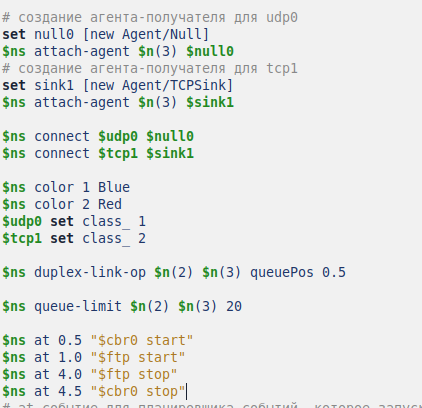
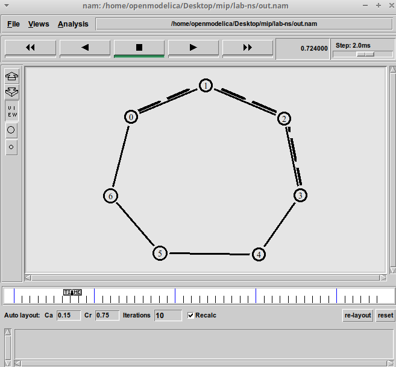
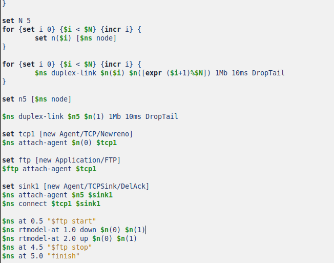
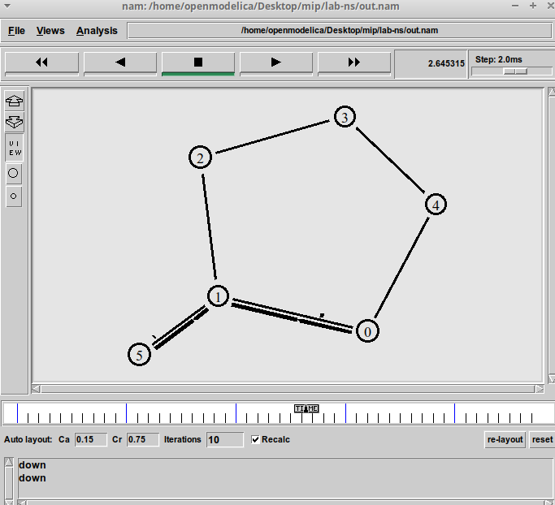

---
## Front matter
lang: ru-RU
title: Лабораторная работа 1
subtitle: Простые модели компьютерной сети
author:
  - Оганниcян Д.Б.
institute:
  - Российский университет дружбы народов, Москва, Россия

## i18n babel
babel-lang: russian
babel-otherlangs: english

## Formatting pdf
toc: false
toc-title: Содержание
slide_level: 2
aspectratio: 169
section-titles: true
theme: metropolis
header-includes:
  - \usepackage{fontspec}
  - \setmainfont{FreeSerif}
  - \setsansfont{FreeSans}
  - \setmonofont{FreeMono}
---
# Информация

## Докладчик

:::::::::::::: {.columns align=center}
::: {.column width="70%"}

  * Оганнисян Давит Багратович
  * студент
  * Российский университет дружбы народов
  * [1132226440@pfur.ru](mailto:1132226440@pfur.ru)
  * <https://dbogannisyanNKA.github.io/ru/>

:::
::: {.column width="25%"}

:::
::::::::::::::

## Цель работы

Приобрести навыки моделирования сетей передачи данных с помощью средства имитационного моделирования NS-2, а также проанализировать полученные результаты моделирования.

## Задание

1. Создать шаблон сценария для NS-2;
2. Выполнить простой пример описания топологии сети, состоящей из двух узлов и одного соединения;
3. Выполнить пример с усложнённой топологией сети;
4. Выполнить пример с кольцевой топологией сети;
5. Выполнить упражнение.

# Выполнение лабораторной работы

## Шаблон сценария для NS-2

{#fig:001 width=70%}

## Шаблон сценария для NS-2

{#fig:002 width=40%}

## Шаблон сценария для NS-2

{#fig:003 width=50%}

## Простой пример описания топологии сети, состоящей из двух узлов и одного соединения

{#fig:004 width=40%}

## Простой пример описания топологии сети, состоящей из двух узлов и одного соединения

{#fig:005 width=50%}

## Пример с усложнённой топологией сети

{#fig:006 width=70%}

## Пример с усложнённой топологией сети

{#fig:007 width=50%}

## Пример с усложнённой топологией сети

{#fig:008 width=50%}

## Пример с усложнённой топологией сети

{#fig:009 width=50%}

## Пример с кольцевой топологией сети

{#fig:010 width=50%}

## Пример с кольцевой топологией сети

{#fig:011 width=50%}

## Пример с кольцевой топологией сети

{#fig:012 width=50%}

## Пример с кольцевой топологией сети

Добавив в начало скрипта после команды создания объекта Simulator:

`$ns rtproto DV`

увидим, что сразу после запуска в сети отправляется небольшое количество
маленьких пакетов, используемых для обмена информацией, необходимой для маршрутизации между узлами.

## Пример с кольцевой топологией сети

{#fig:013 width=50%}

## Упражнение

{#fig:014 width=50%}

## Упражнение

{#fig:015 width=50%}

## Упражнение

{#fig:016 width=50%}

## Упражнение

{#fig:017 width=50%}

## Выводы

В процессе выполнения данной лабораторной работы я приобрел навыки моделирования сетей передачи данных с помощью средства имитационного моделирования NS-2, а также проанализировал полученные результаты моделирования.
