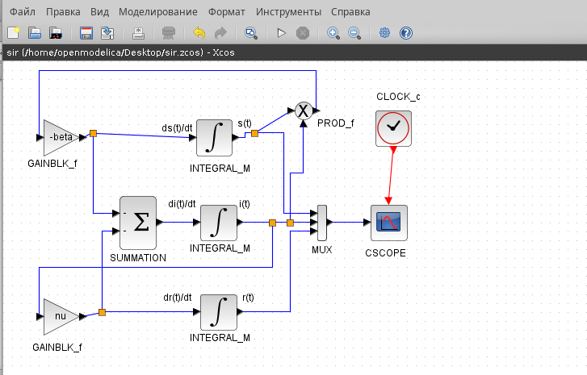
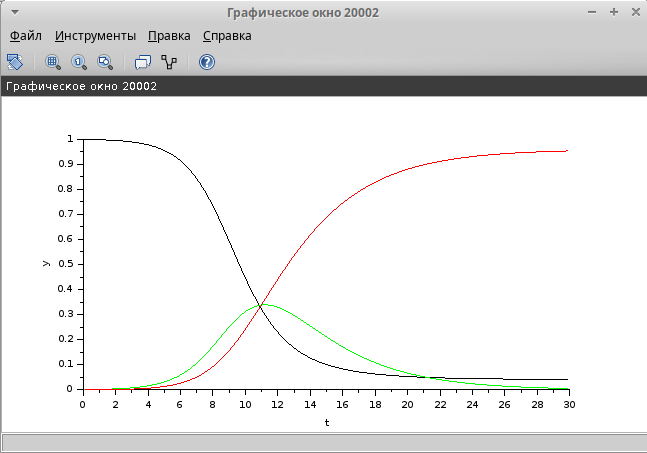
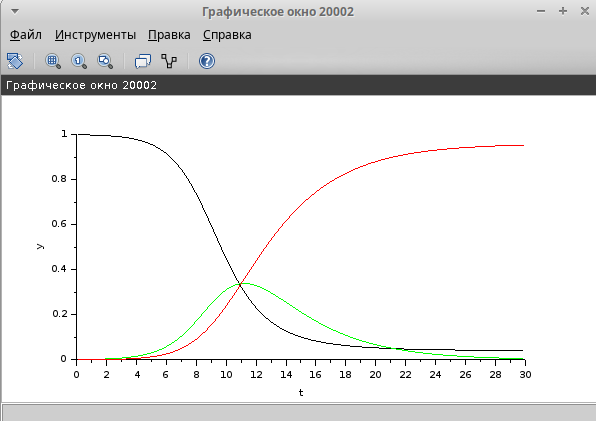

---
## Front matter
lang: ru-RU
title: Лабораторная работа №5
subtitle: Модель эпидемии (SIR)
author:
  - Оганнисян Д. Б.
institute:
  - Российский университет дружбы народов, Москва, Россия

## i18n babel
babel-lang: russian
babel-otherlangs: english

## Formatting pdf
toc: false
toc-title: Содержание
slide_level: 2
aspectratio: 169
section-titles: true
theme: metropolis
header-includes:
 - \metroset{progressbar=frametitle,sectionpage=progressbar,numbering=fraction}
 - '\makeatletter'
 - '\beamer@ignorenonframefalse'
 - '\makeatother'
---

# Информация

## Докладчик

:::::::::::::: {.columns align=center}
::: {.column width="60%"}

  * Оганнисян Давит Багратович
  * студент
  * Российский университет дружбы народов
  * [1132226440@pfur.ru](mailto:1132226440@pfur.ru)
  * <https://dbogannisyanNKA.github.io/ru/>

:::
::: {.column width="25%"}

:::
::::::::::::::

## Цель работы

Построить модель SIR в *xcos* и OpenModelica.

## Задание

1. Реализовать модель SIR в в *xcos*;
2. Реализовать модель SIR с помощью блока Modelica в в *xcos*;
3. Реализовать модель SIR в OpenModelica;
4. Реализовать модель SIR с учётом процесса рождения / гибели особей в xcos (в том числе и с использованием блока Modelica), а также в OpenModelica;
5. Построить графики эпидемического порога при различных значениях параметров модели (в частности изменяя параметр $\mu$);
6. Сделать анализ полученных графиков в зависимости от выбранных значений параметров модели.

## Выполнение лабораторной работы

$$
\begin{cases}
  \dot s = - \beta s(t)i(t); \\
  \dot i = \beta s(t)i(t) - \nu i(t);\\
  \dot r = \nu i(t),
\end{cases}
$$

где $\beta$ -- скорость заражения, $\nu$ -- скорость выздоровления.

## Реализация модели в xcos

Зафиксируем начальные данные: $\beta = 1, \, \nu = 0,3, s(0) = 0,999, \, i(0) = 0,001, \, r(0) = 0.$

## Реализация модели в xcos

{#fig:001 width=70%}

## Реализация модели в xcos

{#fig:002 width=70%}

## Реализация модели в xcos

{#fig:003 width=70%}

## Реализация модели в xcos

{#fig:004 width=70%}

## Реализация модели в xcos

{#fig:005 width=70%}

## Реализация модели в xcos

{#fig:006 width=70%}

## Реализация модели с помощью блока Modelica в xcos

{#fig:007 width=70%}

## Реализация модели с помощью блока Modelica в xcos

{#fig:008 width=50%}

## Реализация модели с помощью блока Modelica в xcos

{#fig:009 width=50%}

## Реализация модели с помощью блока Modelica в xcos

{#fig:010 width=70%}

## Выводы

В процессе выполнения данной лабораторной работы была построена модель SIR в *xcos*.
