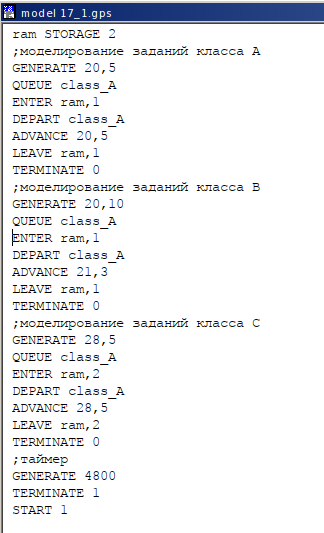
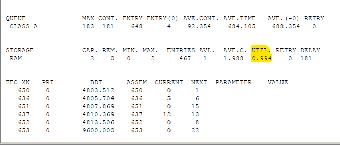
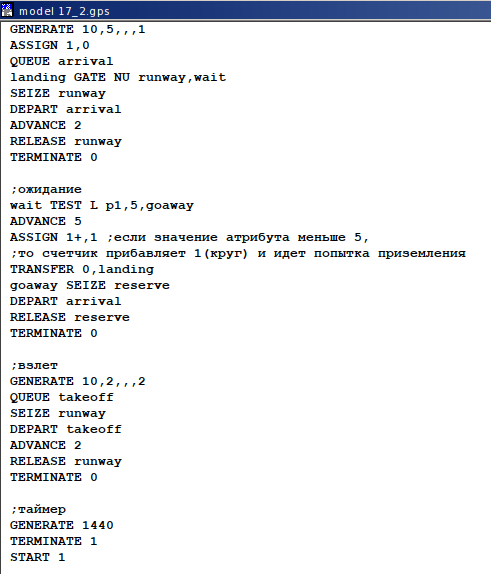
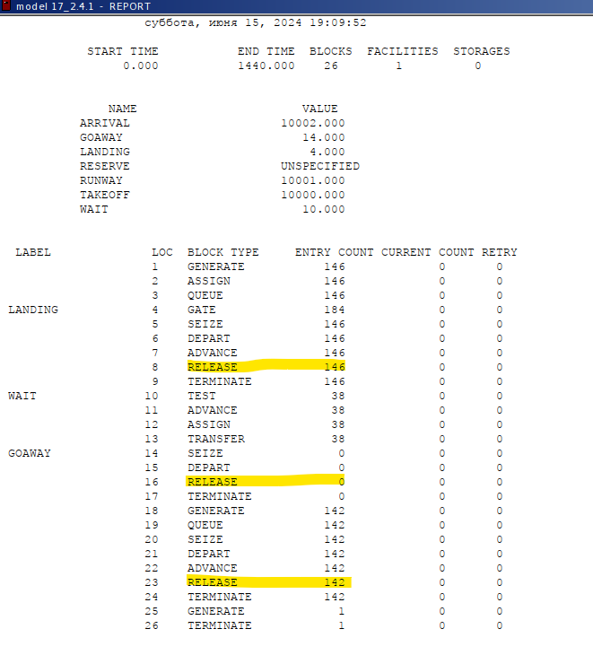
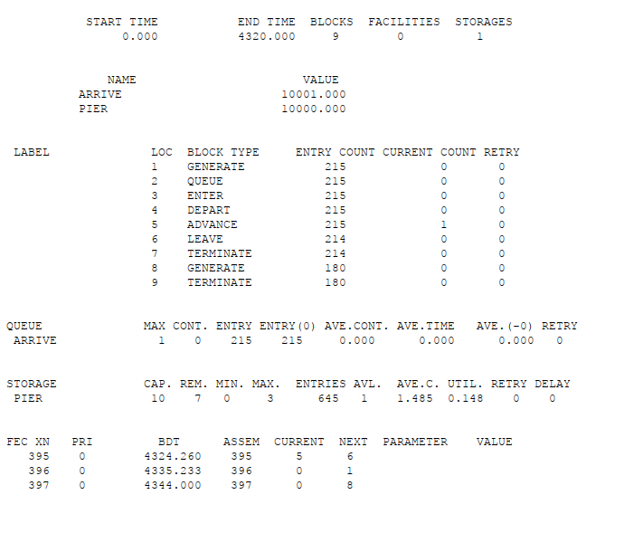
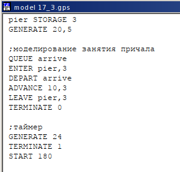
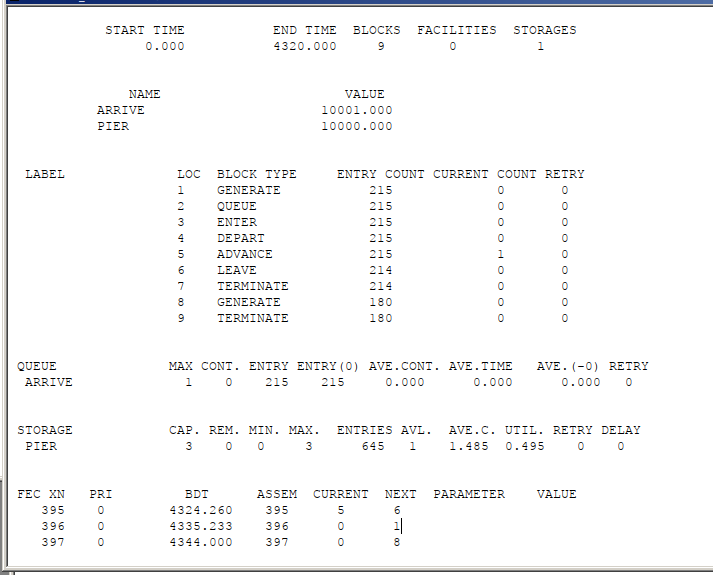
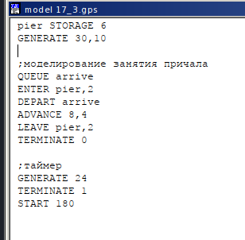
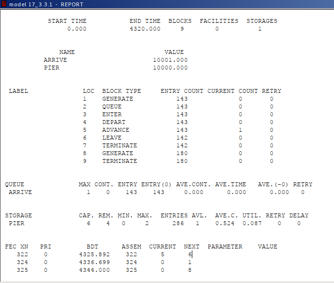
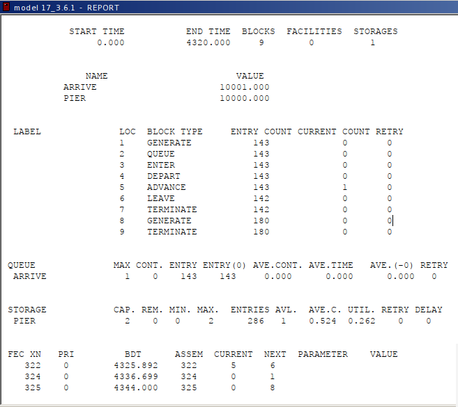

---
## Front matter
title: "Лабораторная работа 17"
subtitle: "Задания для самостоятельной работы"
author: "Оганнисян Давит Багратович"

## Generic otions
lang: ru-RU
toc-title: "Содержание"

## Bibliography
bibliography: bib/cite.bib
csl: pandoc/csl/gost-r-7-0-5-2008-numeric.csl

## Pdf output format
toc: true # Table of contents
toc-depth: 2
lof: true # List of figures
lot: false # List of tables
fontsize: 12pt
linestretch: 1.5
papersize: a4
documentclass: scrreprt
## I18n polyglossia
polyglossia-lang:
  name: russian
  options:
	- spelling=modern
	- babelshorthands=true
polyglossia-otherlangs:
  name: english
## I18n babel
babel-lang: russian
babel-otherlangs: english
## Fonts
mainfont: PT Serif
romanfont: PT Serif
sansfont: PT Sans
monofont: PT Mono
mainfontoptions: Ligatures=TeX
romanfontoptions: Ligatures=TeX
sansfontoptions: Ligatures=TeX,Scale=MatchLowercase
monofontoptions: Scale=MatchLowercase,Scale=0.9
## Biblatex
biblatex: true
biblio-style: "gost-numeric"
biblatexoptions:
  - parentracker=true
  - backend=biber
  - hyperref=auto
  - language=auto
  - autolang=other*
  - citestyle=gost-numeric
## Pandoc-crossref LaTeX customization
figureTitle: "Рис."
tableTitle: "Таблица"
listingTitle: "Листинг"
lofTitle: "Список иллюстраций"
lotTitle: "Список таблиц"
lolTitle: "Листинги"
## Misc options
indent: true
header-includes:
  - \usepackage{indentfirst}
  - \usepackage{float} # keep figures where there are in the text
  - \floatplacement{figure}{H} # keep figures where there are in the text
---

# Цель работы

Реализовать с помощью gpss модели работы вычислительного центра, аэропорта и морского порта.

# Задание

Реализовать с помощью gpss:

- модель работы вычислительного центра;
- модель работы аэропорта;
- модель работы морского порта.

# Выполнение лабораторной работы

## Моделирование работы вычислительного центра

На вычислительном центре в обработку принимаются три класса заданий А, В и С. Исходя из наличия оперативной памяти ЭВМ задания классов А и В могут решаться одновременно, а задания класса С монополизируют ЭВМ. Задачи класса С загружаются в ЭВМ, если она полностью свободна. Задачи классов А и В могут дозагружаться к решающей задаче. 

Смоделируем работу ЭВМ за 80 ч. и определим её загрузку.

Построим модель (рис. [-@fig:001]).

{#fig:001 width=70%}

Задается хранилище ram на две заявки. Затем записаны три блока: первые два обрабатывают задания класса A и B, используя один элемент ram, а третий обрабатывает задания класса C, используя два элемента ram. Также есть блок времени генерирующий 4800 минут (80 часов).

После запуска симуляции получаем отчёт (рис. [-@fig:002], [-@fig:003]).

{#fig:002 width=70%}

{#fig:003 width=70%}

Из отчета увидим, что загруженность системы равна 0.994.

## Модель работы аэропорта

Самолёты прибывают для посадки в район аэропорта каждые $10 \pm 5$ мин. Если взлетно-посадочная полоса свободна, прибывший самолёт получает разрешение на посадку. Если полоса занята, самолет выполняет полет по кругу и возвращается в аэропорт каждые 5 мин. Если после пятого круга самолет не получает разрешения на посадку, он отправляется на запасной аэродром.

В аэропорту через каждые $10 \pm 2$ мин к взлетно -посадочной полосе выруливают готовые к взлёту самолёты и получают разрешение на взлёт, если полоса свободна. Для взлета и посадки самолёты занимают полосу ровно на 2 мин. Если при свободной полосе одновременно один самолёт прибывает для посадки, а другой -- для взлёта, то полоса предоставляется взлетающей машине.

Требуется:

- выполнить моделирование работы аэропорта в течение суток;
- подсчитать количество самолётов, которые взлетели, сели и были направлены на запасной аэродром;
- определить коэффициент загрузки взлетно-посадочной полосы.

Построим модель (рис. [-@fig:004]).

{#fig:004 width=70%}

Блок для влетающих самолетов имеет приоритет 2, для прилетающий приоритет 1 (чем выше значение, тем выше приоритет). Происходит проверка: если полоса пустая, то заявка просто отрабатывается, если нет, то происходит переход в блок ожидания. При ожидании заявка проходит в цикле 5 раз, каждый раз проверяется не освободилась ли полоса, если освободилась -- переход в блок обработки, если нет -- самолет обрабатывается дополнительным обработчиком отправления в запасной аэродром. Время задаем в минутах -- 1440 (24 часа).

После запуска симуляции получаем отчёт (рис. [-@fig:005], [-@fig:006]).

{#fig:005 width=90%}

{#fig:006 width=90%}

Взлетело 142 самолета, село 146, а в запасной аэропорт отправилось 0. В запасной аэропорт не отправились самолеты, поскольку процессы обработки длятся всего 2 минуты, что намного быстрее, чем генерации новых самолетов. Коэффициент загрузки полосы равняется 0.4, полоса большую часть времени не используется.

## Моделирование работы морского порта

Морские суда прибывают в порт каждые $[\alpha \pm \delta]$ часов. В порту имеется N причалов. Каждый корабль по длине занимает M причалов и находится в порту $[b \pm \varepsilon]$ часов.
Требуется построить GPSS-модель для анализа работы морского порта в течение полугода, определить оптимальное количество причалов для эффективной работы порта.

Рассмотрим два варианта исходных данных:

1) $a = 20$ ч, $\delta = 5$ ч, $b = 10$ ч, $\varepsilon = 3$ ч, $N = 10$, $M = 3$;
2) $a = 30$ ч, $\delta = 10$ ч, $b = 8$ ч, $\varepsilon = 4$ ч, $N = 6$, $M = 2$.

**Первый вариант модели**

Построим модель для первого варианта (рис. [-@fig:007]).

{#fig:007 width=70%}

После запуска симуляции получаем отчёт (рис. [-@fig:008]).

{#fig:008 width=90%}

При запуске с 10 причалами видно, что судна обрабатываются быстрее, чем успевают приходить новые, так как очередь не набирается. Кроме того загруженность причалов очень низкая. Соответственно, установив наименьшее возможное число причалов -- 3 (рис. [-@fig:009]), получаем оптимальный результат, что видно на отчете (рис. [-@fig:010]).

{#fig:009 width=90%}

{#fig:010 width=90%}

**Второй вариант модели**

Построим модель для второго варианта (рис. [-@fig:011]).

{#fig:011 width=70%}

После запуска симуляции получаем отчёт (рис. [-@fig:012]).

{#fig:012 width=90%}

При запуске с 6 причалами видно, что судна обрабатываются быстрее, чем успевают приходить новые, так как очередь не набирается. Кроме того загруженность причалов очень низкая. Соответственно, установив наименьшее возможное число причалов -- 2 (рис. [-@fig:013]), получаем оптимальный результат, что видно из отчета (рис. [-@fig:014]).

{#fig:013 width=90%}

{#fig:014 width=90%}

# Выводы

В результате выполнения данной лабораторной работы я реализовал с помощью gpss:

- модель работы вычислительного центра;
- модель работы аэропорта;
- модель работы морского порта.
